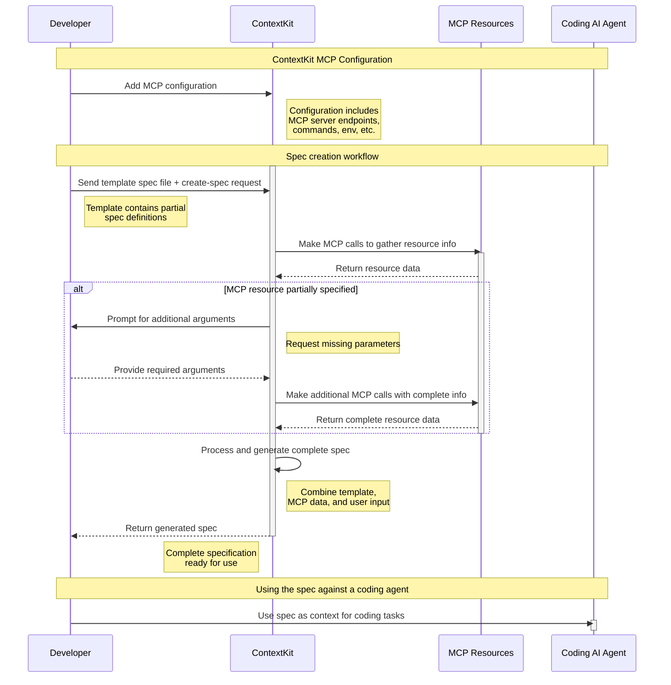

# ContextKit
ContextKit is a CLI tool and MCP client, used to create spec files for AI coding agents with context baked in, based on reusable spec templates.

ContextKit aims to simplify and automate the process of creating spec files for AI coding agents. Instead of creating or modifying spec files for each task in a project, ContextKit allows developers to define reusable spec templates that can be filled with context from various sources, either automatically or by providing just the necessary task-specific context variables, such as a ticket ID or Figma URL.

## How it works
By being an MCP client, ContextKit utilizes the evolving MCP ecosystem to inject context into spec files from various sources, such as ticketing systems, databases, document storage, and design tools. It works with spec templates - reusable spec files, containing context variables, that define the common structure and requirements of tasks in a project. The context variables are either fully specified or partially specified MCP resources and tools.

If a context variable can be fulfilled by fetching an MCP resource, then it will be automatically fetched and injected into the spec file when generating the spec. If the context variable is a partial MCP resource, the user will be prompted to complete it before the spec file is generated. Usually the missing arguments in the MCP resource or tool are task-specific, such as a ticket ID or a Figma URL.



## Real world example
TBD (show template, generation of two specs, and the spec files)

## But why?
- Reduce cost and time. AI agents won't need to make additional MCP calls.
- Cleaner codebase: Keep spec templates in your codebase rather than specific task related documents.

## Usage

### Add MCP tool calls with variables

```
# Spec Template (spec.md)


### Description
{{ ticket.description }}
```

Generating the spec with a ticket ID:
```
cxk create-spec spec.md --var ticket_id=ACME-123
```

This will fetch the ticket and add its description to the spec file.

### Add MCP resources with variables
```
# Spec Template (spec.md)
## PRD
{{ get_resource('doc-storage-service', 'docs://'+prd_id) }}
```

Generating the spec with a PRD ID:
```
cxk create-spec spec.md --var prd_id=PRD-456
```

### Filtering context

MCP resources can quickly oversaturate the context. With the template engine, you can apply filters and selectors to include only relevant parts of resources. For example:

```
## Ticket description

{{ ticket_info.fields.description }}
```

You can also filter resources to mask sensitive information:

```
## Support ticket

{{ support_ticket_info | regex_replace(r'\b[\w.+-]+@[\w.-]+\.\w+\b', '[EMAIL_REDACTED]') }}
```

### Interactively selecting MCP resources and tools

Template variables can be given values either directly or by selecting an MCP tool to call. For example:

```
# Spec Template (spec.md)

## Task description
{{ task }}
```

Running create-spec will then prompt you to either provide a direct value for `task` or select an MCP server, tool and args to call to fetch the task description.


### Initialize a project
```
cxk init
```
Initialize a new ContextKit project in the current directory.

### MCP Server Management

Add an SSE MCP server:
```
cxk mcp add-sse <server-name> <url>
```

Add a stdio MCP server:
```
cxk mcp add-stdio <server-name> [--env key=value] -- <command> [args...]
```

Add an HTTP MCP server:
```
cxk mcp add-http <server-name> <url>
```

### MCP Configuration Examples

```
# Initialize a new project
cxk init

# Add an SSE server
cxk mcp add-sse my-server ws://localhost:3000

# Add a stdio server with environment variables
cxk mcp add-stdio my-stdio-server --env API_KEY=secret -- python server.py

# Add an HTTP server
cxk mcp add-http my-http-server http://localhost:8000
```

